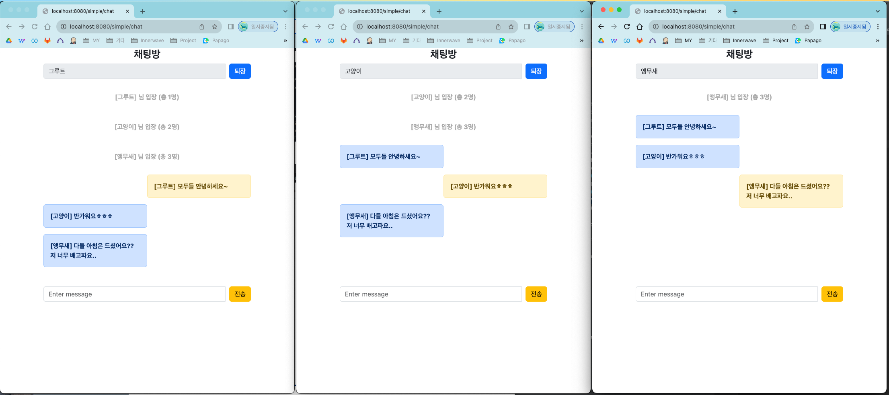

# demo-websocket

## 👩🏻‍💻 Development environment

| items       | version |
|-------------|---------|
| Intellij    |         |
| Spring boot | 3.1.3   |
| gradle      | 8.2.1   |
| java        | 17      |

## 📝 Release Note
### 0.0.2 - 2023.09.20
- 여러 채팅방으로 개선
- WebSocket Emulation을 지원하는 **SockJS**를 통해 다양한 브라우저에서 동작하도록 수정
- 

### 0.0.1 - 2023.09.20
- WebSocketConfigurer을 통해 아주 간단한 채팅 구현

## 📎 Reference
- https://dev-gorany.tistory.com/212
- https://velog.io/@koseungbin/WebSocket